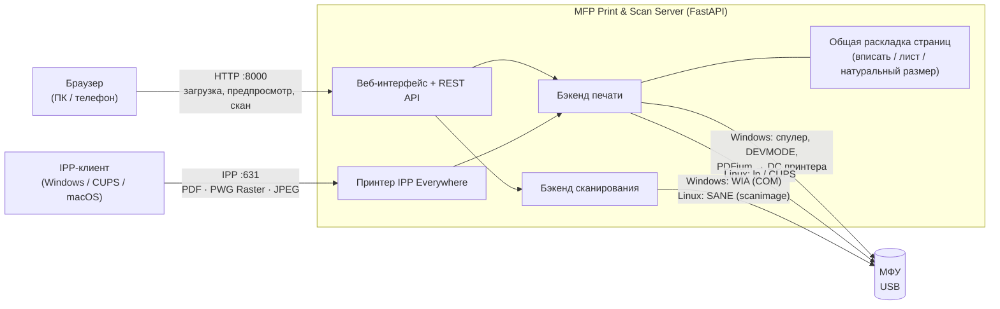

# 🖨️ MFP Print & Scan Server

[English](README.md) · **Русский**

Небольшой сервер для дома или небольшого офиса, который превращает USB-принтер или МФУ в сетевое устройство:

- **печать** PDF и картинок из браузера — с телефона, планшета или другого компьютера — с настоящим предпросмотром;
- **сетевой принтер** на других компьютерах: сервер работает как принтер **IPP Everywhere**, поэтому Windows, Linux (CUPS), macOS, Android и iOS печатают через **встроенный драйвер системы**. Драйвер производителя на каждом клиенте не нужен;
- **сканирование** из браузера в духе [phpSane](https://github.com/gawindx/phpSane): предпросмотр стекла, выделение области, разрешение, режим, формат, сборка страниц в один PDF, **копирование** в натуральную величину;
- **обслуживание** принтера: пробная страница ОС, а для Canon PIXMA ещё проверка дюз и очистка печатающей головки.

Работает на **Windows** (спулер печати Win32 + WIA) и **Linux** (CUPS + SANE). Интерфейс на **русском и английском**.


<details>
<summary>Ещё скриншоты</summary>


</details>

---

## Содержание

- [Зачем](#зачем)
- [Возможности](#возможности)
- [На чём проверено](#на-чём-проверено)
- [Быстрый старт](#быстрый-старт)
  - [Windows](#windows)
  - [Linux](#linux)
  - [Запуск как служба](#запуск-как-служба)
- [Как пользоваться](#как-пользоваться)
  - [Печать из браузера](#печать-из-браузера)
  - [Сетевой принтер (IPP)](#сетевой-принтер-ipp)
  - [Сканирование и копирование](#сканирование-и-копирование)
  - [Обслуживание принтера](#обслуживание-принтера)
  - [Язык](#язык)
- [Настройки](#настройки)
  - [Пользователи и вход](#пользователи-и-вход)
- [Как это устроено](#как-это-устроено)
- [HTTP API](#http-api)
- [Данные на диске](#данные-на-диске)
- [Безопасность](#безопасность)
- [Решение проблем](#решение-проблем)
- [Расширение](#расширение)
- [Разработка](#разработка)
- [Известные ограничения](#известные-ограничения)
- [Лицензия](#лицензия)

---

## Зачем

У недорогих струйных МФУ вроде Canon PIXMA MG2500 **только USB**: ни Wi‑Fi, ни сетевой печати, ни сканирования с телефона. Общий доступ средствами Windows требует драйвер производителя на каждом компьютере и никак не помогает телефонам. Проект ставит рядом с принтером один постоянно включённый компьютер и делает принтер доступным всей локальной сети:

- всё, где есть браузер, может печатать и сканировать;
- всё, где есть IPP-клиент (любая современная ОС), печатает через свой встроенный драйвер.

## Возможности

### Печать
- Загрузка файла (можно перетащить), выбор принтера, числа копий и **настроек, которые сообщает драйвер принтера**: размер и тип бумаги, качество, цветность, двусторонняя печать. Ничего не захардкожено, поэтому другой принтер покажет свои настройки.
- **PDF и картинки сервер рисует сам** (PDFium / Pillow) прямо на принтер. Поэтому печать не зависит от установленных программ, а настройки применяются только к этому заданию, умолчания принтера не меняются.
- **Точный предпросмотр** для PDF и картинок: реальный размер листа и аппаратные поля принтера, страница вписана ровно так, как будет напечатана, альбомные страницы поворачиваются, ч/б показывается в оттенках серого. Предпросмотр и печать используют один и тот же код раскладки.
- **Документы и текст** (`.txt`, `.rtf`, `.docx`, `.odt`, `.xlsx`, `.pptx`, …): если на сервере установлен [LibreOffice](https://ru.libreoffice.org/), они конвертируются в PDF и дальше печатаются и показываются в предпросмотре точно так же, как PDF, на Windows и Linux. Текстовые файлы не в UTF-8 (например, Windows-1251) сначала перекодируются, чтобы кириллица не превращалась в кракозябры. Без LibreOffice их печатает программа, зарегистрированная для этого типа файлов (Блокнот, Word/WordPad, …), и предпросмотра нет.
- **Правила «тип бумаги ↔ размер»**: некоторые принтеры отвергают отдельные сочетания, например глянцевую фотобумагу 13×18 на Canon (ошибка 4102). Сервер сам подставляет подходящий тип бумаги и пишет пояснение в задании. Интерфейс подстраивает пару так же, прямо при выборе.
- **История заданий**: статус, настройки, пояснения. Хранится в JSON-файле и не пропадает после перезапуска. Можно удалить отдельную запись или очистить всё; загруженные файлы удаляются вместе с записями.

### Сетевой принтер (IPP Everywhere)
- Сервер — принтер IPP/2.0 на порту 631 (`ipp://<хост>:631/ipp/print`).
- Клиенты сами раскладывают документ и присылают **PDF, PWG Raster или JPEG** под размеры и поля, которые сообщил сервер. Сервер печатает их 1:1.
- Возможности берутся из реального драйвера: 20+ размеров бумаги со стандартными именами PWG и реальными полями, типы бумаги, цвет, дуплекс, качество.
- Проверено с клиентами Linux/CUPS: текстовый редактор, LibreOffice, PDF, фото.

### Сканирование
- Возможности сканера берутся у драйвера: размер стекла, разрешения, режимы, яркость и контраст.
- **Предпросмотр всего стекла** в низком разрешении. **Область выделяется мышью**, либо выбирается шаблон: A4, A5, A6, Letter, фото 10×15, визитка.
- Цветной / оттенки серого / ч/б (текст), 75–600 dpi (сколько умеет сканер); показывается итоговый размер в пикселях.
- Сохранение в **JPEG, PNG, TIFF или PDF** с правильным DPI в файле.
- Галерея сканов: открыть, скачать, удалить, **собрать отмеченные в один многостраничный PDF** (в порядке отметки).
- **Копирование**: печать скана в натуральную величину. Отсканированная визитка печатается визиткой, а не растягивается на A4.

### Обслуживание
- **Пробная страница**: стандартная пробная страница ОС, для любого принтера.
- **Проверка дюз** и **очистка головки** для струйных Canon: байт в байт то же задание обслуживания, что отправляет сам драйвер Canon (переключение режима IVEC + команды BJL). Формат снят с очереди печати драйвера Windows.

### Прочее
- Необязательный **вход по паролю** (`auth = yes` в `config.ini`): пользователи и пароли (хешем или открытым текстом) в конфиге, запоминание входа, защита от подбора, HTTP Basic для скриптов, по желанию Basic-авторизация для IPP.
- Один **файл настроек** (`config.ini`) для языка, портов, папок и пользователей.
- Интерфейс **на русском и английском**, выбор запоминается; сообщения сервера на языке страницы.
- **Запоминание настроек печати и сканирования**: последний принтер, число копий, настройки для каждого принтера отдельно, а также последний сканер, область, режим, разрешение, яркость/контраст и формат хранятся в куки браузера (не на сервере) и подставляются при следующем визите.
- Работает с телефона (адаптивная вёрстка).
- Запуск на Windows одним щелчком (`start.bat`), скрипт запуска для Linux (`start.sh`).
- На Windows **не нужны права администратора**: настройки принтера пишутся на уровне пользователя, нужен только доступ к спулеру.

## На чём проверено

| Компонент | Статус |
|---|---|
| Windows 10 Enterprise LTSC 2021 (21H2), Python 3.12 | ✅ сервер: печать, предпросмотр, IPP, сканирование, интерфейс обслуживания |
| Canon PIXMA MG2541 (драйвер «Canon MG2500 series Printer», USB) | ✅ печать (PDF, картинки, текст), сканирование через WIA |
| Клиент Linux (CUPS, driverless IPP Everywhere) → этот сервер | ✅ печать из GNOME Text Editor, LibreOffice, просмотрщика PDF |
| Клиент Windows с «Microsoft IPP Class Driver» | ⚠️ сделано по спецификации, на реальном клиенте ещё не подтверждено |
| Сервер на Linux (печать через CUPS) | ✅ печать проверялась в начале проекта |
| Сервер на Linux — сканирование через SANE (предпросмотр, выбор области, цвет/ЧБ/градации серого, JPEG/PNG/TIFF/PDF, склейка в PDF) | ✅ проверено целиком на реальном Canon PIXMA MG2500 через `scanimage` |
| Сервер на Linux — предпросмотр печати (рендер PDF/картинок, поля) | ✅ проверено; точные аппаратные поля на Linux недоступны (используется запасной вариант A4 + 5 мм) |
| Сервер на Linux — обслуживание: пробная страница ОС, проверка дюз и очистка головки Canon (через CUPS/`lp`) | ✅ подтверждено на MG2500 — распечаталась и пробная страница CUPS, и шаблон дюз, слышна работа очистки головки |
| Обслуживание на Windows: пробная страница (сервер от администратора), проверка дюз и очистка головки Canon | ✅ подтверждено на MG2541 |
| Документы через LibreOffice 26.8 на Windows (TXT в UTF-8 и Windows-1251, RTF, DOCX, XLSX) | ✅ конвертация, предпросмотр и печать проверены (печать в Microsoft Print to PDF) |
| Документы через LibreOffice 24.2 на Linux (TXT в UTF-8 и Windows-1251, DOCX, RTF) | ✅ проверены конвертация, предпросмотр (кириллица корректна) и кэширование конвертации; готовый PDF корректно доходит до CUPS — физическую печать на бумаге в этот раз не подтвердили (принтер был отключён) |
| Автозапуск на Windows (`register_service.bat`) | ✅ подтверждено полной перезагрузкой компьютера: задача регистрируется в планировщике, сервер поднимается сам ещё до входа в систему |
| Unit-файл systemd для Linux | ✅ подтверждено: установлен под отдельным системным пользователем `mfp` (включён в автозагрузку), реально обрабатывает запросы и достаёт до USB-сканера через группу `scanner` |

Отчёты о других принтерах и сканерах очень приветствуются, см. [Расширение](#расширение).

## Быстрый старт

### Windows

Что нужно:
- Windows 10 или 11;
- [Python 3.11+ с python.org](https://www.python.org/downloads/windows/): при установке отметьте **«Add python.exe to PATH»**;
- принтер, установленный с обычным драйвером, чтобы печать, например из Блокнота, уже работала;
- по желанию [LibreOffice](https://ru.libreoffice.org/download/): для точной печати и предпросмотра документов и текстовых файлов. Он находится автоматически в стандартной папке установки; после установки перезапустите сервер.

Как запустить:
1. Скачайте или клонируйте репозиторий.
2. Дважды щёлкните **`start.bat`**.

При первом запуске он создаст виртуальное окружение `.venv` и поставит зависимости. Потом он переустанавливает их, только если изменился `requirements.txt`. Затем покажет адреса для входа:

```
[MFP] Web UI:         http://localhost:8000
[MFP] On the network: http://192.168.1.20:8000   IPP printer: ipp://192.168.1.20:631/ipp/print
```

Остановить сервер — <kbd>Ctrl</kbd>+<kbd>C</kbd> или закрыть окно.

**Автозапуск:** чтобы сервер работал в фоне с момента загрузки Windows, см. [Запуск как служба](#запуск-как-служба).

**Доступ с других устройств:** при первом запуске Windows спросит про брандмауэр; разрешите доступ для частных сетей. Для IPP-клиентов откройте ещё и порт 631 (в PowerShell от администратора):

```powershell
New-NetFirewallRule -DisplayName "MFP Print & Scan Server (IPP)" -Direction Inbound -Protocol TCP -LocalPort 631 -Action Allow
New-NetFirewallRule -DisplayName "MFP Print & Scan Server (Web)" -Direction Inbound -Protocol TCP -LocalPort 8000 -Action Allow
```

> **Совет.** В Windows 10/11 настройка «Разрешить Windows управлять принтером, используемым по умолчанию» делает основным последний использованный принтер. Чтобы основным для сервера оставалось ваше МФУ, выключите её в *Параметры → Устройства → Принтеры и сканеры*.

### Linux

Что нужно:
- Python 3.11+ с `venv` (`sudo apt install python3-venv`);
- CUPS с настроенным принтером (он виден в `lpstat -a`);
- для сканирования — SANE: `sudo apt install sane-utils`, сканер должен быть виден в `scanimage -L`;
- по желанию LibreOffice, для печати офисных документов (`sudo apt install libreoffice`).

Как запустить:

```bash
git clone <этот репозиторий> mfp-print-scan-server
cd mfp-print-scan-server
chmod +x start.sh
./start.sh
```

На Linux встроенный IPP-принтер выключен: CUPS сам является IPP-сервером. Для общего доступа используйте CUPS (`sudo cupsctl --share-printers`, затем «Share this printer» в веб-панели CUPS).

### Запуск как служба

#### Windows: `register_service.bat` / `unregister_service.bat`

Дважды щёлкните **`register_service.bat`** и подтвердите запрос прав администратора. Скрипт:

1. готовит `.venv` (так же, как `start.bat`);
2. регистрирует **задачу планировщика «MFP Print & Scan Server»**, которая:
   - запускается **при старте Windows**, ещё до входа пользователя, без окна консоли;
   - работает **от вашей учётной записи без сохранения пароля** (вход S4U), поэтому видит те же принтеры, настройки и принтер по умолчанию, что и вы;
   - перезапускает сервер, если он завершился (раз в минуту), без ограничения по времени работы;
   - пишет лог в **`logs\server.log`** (после 5 МБ предыдущий лог сохраняется как `server.log.1`);
3. открывает TCP 8000 и 631 в брандмауэре Windows для частных и доменных сетей и предупреждает, если ваша сеть помечена как *Общедоступная*;
4. сразу запускает сервер и проверяет, что он отвечает.

Почему задача планировщика, а не классическая служба Windows:
- `python.exe` не умеет быть программой службы;
- служба от имени SYSTEM не видела бы ваш принтер по умолчанию и ваши пользовательские настройки принтера.

Если открыто окно `start.bat`, сначала закройте его, иначе порты заняты. Повторный запуск скрипта обновляет задачу. Порты берутся из `config.ini`, поэтому после их изменения там запустите скрипт ещё раз: правила брандмауэра обновятся.

Управление:

| Что | Как |
|---|---|
| состояние, запуск, остановка | Планировщик заданий (`taskschd.msc`) → *MFP Print & Scan Server*, либо `Get-ScheduledTask "MFP Print & Scan Server"` / `Start-ScheduledTask` / `Stop-ScheduledTask` |
| лог | `logs\server.log` |
| удалить | дважды щёлкните **`unregister_service.bat`**: остановит и удалит задачу и правила брандмауэра. История, сканы и логи останутся |

> **Обновление кода**, пока сервер работает как служба: остановите задачу (или запустите `unregister_service.bat`), замените файлы и снова запустите `register_service.bat`.

#### Linux: systemd

Пример unit-файла — [`deploy/mfp-print-scan-server.service`](deploy/mfp-print-scan-server.service). В нём код лежит в `/opt/mfp-print-scan-server`, а сервер работает от отдельного пользователя `mfp`:

```bash
# 1. Разложить код и создать служебную учётную запись
sudo cp -r mfp-print-scan-server /opt/mfp-print-scan-server
sudo useradd --system --home /opt/mfp-print-scan-server --shell /usr/sbin/nologin mfp
sudo chown -R mfp:mfp /opt/mfp-print-scan-server

# 2. Создать .venv и поставить зависимости от имени этого пользователя
sudo -u mfp /opt/mfp-print-scan-server/start.sh --setup-only

# 3. Установить и запустить службу
sudo cp /opt/mfp-print-scan-server/deploy/mfp-print-scan-server.service /etc/systemd/system/
sudo systemctl daemon-reload
sudo systemctl enable --now mfp-print-scan-server
```

Перед установкой проверьте в unit-файле:
- `User=` / `Group=`: от чьего имени работает сервер;
- `SupplementaryGroups=lp scanner`: группы для печати и доступа к USB-сканеру. Если какой-то группы в системе нет, systemd откажется запускать службу, поэтому проверьте через `getent group scanner` и уберите лишние;
- `WorkingDirectory=` / `ExecStart=`: поменяйте, если код лежит не в `/opt/mfp-print-scan-server`;
- `Environment=`: любые переменные из раздела [Настройки](#настройки).

Управление:

```bash
systemctl status mfp-print-scan-server       # состояние
journalctl -u mfp-print-scan-server -f       # лог в реальном времени
sudo systemctl restart mfp-print-scan-server # после обновления кода или настроек
sudo systemctl disable --now mfp-print-scan-server && sudo rm /etc/systemd/system/mfp-print-scan-server.service  # удалить
```

## Как пользоваться

### Печать из браузера

1. Откройте `http://<сервер>:8000`.
2. Перетащите файл или нажмите, чтобы выбрать его.
3. Выберите принтер и настройки. Список настроек берётся у драйвера этого принтера.
4. По желанию нажмите **Предпросмотр**. Пока он открыт, он обновляется при каждом изменении.
5. Нажмите **Печать**. Задание появится в **Последних заданиях**. Если сервер что-то поправил (например, тип бумаги), рядом со статусом будет ⚠ с пояснением.

| Формат | Как печатается | Предпросмотр |
|---|---|---|
| PDF | рисует сервер (PDFium) | ✅ точный |
| JPEG, PNG, BMP, GIF, TIFF, WebP | рисует сервер (Pillow) | ✅ точный |
| TXT, RTF, DOC/DOCX, ODT, XLS/XLSX, ODS, CSV, PPT/PPTX, ODP | **с установленным LibreOffice:** конвертируются в PDF и дальше как PDF (Windows и Linux) | ✅ точный, с LibreOffice |
| те же, **без LibreOffice** | Windows: программа, зарегистрированная для печати этого типа; Linux: CUPS с исходным файлом | — |

### Сетевой принтер (IPP)

Сервер — принтер **IPP Everywhere** по адресу `ipp://<сервер>:631/ipp/print`. Он отвечает и на `ipp://<сервер>:631/`, и на `ipp://<сервер>:631/ipp`, потому что некоторые клиенты позволяют ввести только имя хоста. Клиенты используют **свой встроенный драйвер**, а предпросмотр видно в их собственном окне печати.

**Linux (CUPS)**
```bash
sudo lpadmin -p MFP -E -v ipp://192.168.1.20:631/ipp/print -m everywhere
```
Или через *Параметры → Принтеры → Добавить*, либо на `http://localhost:631/admin`: укажите адрес и драйвер «IPP Everywhere» / «driverless».

**Windows 10/11**
1. Откройте *Параметры → Устройства → Принтеры и сканеры → Добавить принтер или сканер → «Необходимый принтер отсутствует в списке»*.
2. Выберите *«Добавить принтер по его TCP/IP-адресу или имени узла»*.
3. В поле *Тип устройства* выберите **Устройство IPP** и введите адрес сервера.

Windows сама возьмёт **Microsoft IPP Class Driver**.

**macOS / iOS / Android.** Они ищут принтеры через Bonjour (mDNS), а он пока не реализован (см. [Известные ограничения](#известные-ограничения)). На macOS принтер можно добавить вручную: *Системные настройки → Принтеры → Добавить → IP*, протокол «IPP», адрес `192.168.1.20`, очередь `ipp/print`.

Всё, что сервер сообщает клиентам, собирается из реального драйвера принтера: размеры бумаги с аппаратными полями, типы бумаги, цвет, дуплекс, качество, 300/600 dpi для растровых клиентов. Задания печатаются «страница = лист», поэтому поля, которые оставил клиент, оказываются на бумаге ровно там же.

### Сканирование и копирование

1. Откройте вкладку **Сканирование** и положите документ лицом вниз в угол стекла.
2. Нажмите **Предпросмотр**: всё стекло в низком разрешении, несколько секунд.
3. Выделите мышью область или выберите шаблон. Выделение можно перетаскивать; простой щелчок возвращает «всё стекло».
4. Выберите режим, разрешение, яркость/контраст и формат. Строка ниже показывает итоговый размер в пикселях.
5. Нажмите **Сканировать**. Результат появится в **Сканах**.

В галерее:
- отметьте сканы и нажмите **Собрать PDF из выбранных**; страницы пойдут в порядке отметки;
- **Печать** делает копию в натуральную величину на принтере, выбранном на вкладке «Печать».

### Обслуживание принтера

Под кнопкой печати есть строка **Обслуживание** для выбранного принтера:

| Действие | Принтеры | Что делает |
|---|---|---|
| Пробная страница | любые | стандартная пробная страница ОС (`Win32_Printer.PrintTestPage` / `testprint` из CUPS). На Windows работает, только если сервер запущен **от имени администратора**: иначе Windows её не разрешает |
| Проверка дюз | струйные Canon | печатает шаблон проверки дюз — пропуски в нём значат, что нужна очистка |
| Очистка головки | струйные Canon | прочищает печатающую головку (расходует чернила, ~1 минута) |

Каждое действие просит подтверждения и записывается в историю заданий.

### Язык

Переключатель **RU / EN** в правом верхнем углу запоминает выбор в cookie на год. Пока язык не выбран, страница открывается на английском: ключ `defaultlang` в [`config.ini`](#настройки). Чтобы вместо этого подстраиваться под язык каждого браузера, укажите `defaultlang = auto`. Сообщения сервера (названия настроек, ошибки) идут на языке страницы.

Чтобы открыть страницу на нужном языке, не меняя сохранённый выбор, добавьте к адресу `?lang=en` или `?lang=ru`.

Названия бумаги вроде «Обычная бумага» / «Plain Paper» отдаёт драйвер принтера на **языке Windows**, сервер их не переводит.

## Настройки

Настройки лежат в **`config.ini`** рядом с `run.py`. При первом запуске он создаётся из [`config.example.ini`](config.example.ini), где описан каждый ключ. Редактируйте `config.ini`, а не пример. `config.ini` исключён из git, потому что в нём могут быть пароли. **После изменений перезапустите сервер.**

```ini
defaultlang = en
port = 8000
ipp_port = 631
ipp_printer =
data_dir = data
scans_dir = scans
auth = none
ipp_auth = no
session_days = 30

[users]
# имя = пароль
```

| Ключ | По умолчанию | Что задаёт | Переменная окружения |
|---|---|---|---|
| `defaultlang` | `en` | язык интерфейса, пока пользователь не выбрал его переключателем RU / EN; также для IPP-заданий. `en`, `ru` или `auto` — язык каждого браузера, а если его нет, язык ОС | `MFP_LANG` |
| `port` | `8000` | порт веб-интерфейса и API | `MFP_PORT` |
| `ipp_port` | `631` | порт IPP-принтера (только Windows); `0` — выключить IPP | `MFP_IPP_PORT` |
| `ipp_printer` | *(пусто)* | на какой принтер печатает IPP; пусто — принтер ОС по умолчанию. По умолчанию пропускаются виртуальные принтеры (PDF, XPS, Fax) и IPP-принтеры, указывающие на этот же сервер | `MFP_IPP_PRINTER` |
| `data_dir` | `data` | история заданий и ключ подписи сессий; относительные пути — от папки проекта | `MFP_DATA_DIR` |
| `scans_dir` | `scans` | где хранятся сканы | `MFP_SCANS_DIR` |
| `auth` | `none` | `none`: доступ у всех в сети; `yes`: нужен вход, см. [Пользователи и вход](#пользователи-и-вход) | `MFP_AUTH` |
| `ipp_auth` | `no` | `yes`: печать по IPP тоже требует имя и пароль (HTTP Basic) | `MFP_IPP_AUTH` |
| `session_days` | `30` | сколько дней действует «Запомнить меня» | `MFP_SESSION_DAYS` |

Переменные окружения сильнее файла. Это удобно для разового запуска, например `$env:MFP_PORT = "8080"; .\start.ps1`. Ещё две переменные:
- `MFP_CONFIG`: взять другой файл конфигурации;
- `MFP_RELOAD=1`: автоперезагрузка для разработки, см. [Разработка](#разработка).

### Пользователи и вход

При `auth = yes` вход нужен для всех страниц, вызовов API и скачивания сканов. Открыты только страница входа и статические файлы. Пользователи перечисляются в секции `[users]`:

```ini
auth = yes

[users]
anna = pbkdf2_sha256$390000$...$...
john = пароль-открытым-текстом
```

**Пароли** можно писать открытым текстом, но лучше хешем:

```bash
.venv\Scripts\python run.py --hash-password     # Linux: .venv/bin/python run.py --hash-password
```

Команда дважды спросит пароль и выведет строку вида `pbkdf2_sha256$390000$...`; вставьте её после `имя = `. В лог сервера пишется предупреждение о пользователях с паролем открытым текстом.

> В `config.ini` символы `;` или `#` после пробела начинают комментарий, поэтому пароль открытым текстом, содержащий « #» или « ;», обрежется. У хешей такой проблемы нет.

**Как это работает:**
- В браузере появляется **страница входа**. «Запомнить меня» сохраняет вход на `session_days` дней; без этой галочки сессия закончится при закрытии браузера. Кнопка **Выйти** в правом верхнем углу.
- Сессии — подписанные cookie (HttpOnly, SameSite=Lax), подписанные случайным ключом из `data/secret.key`. Они переживают перезапуск сервера. Смена пароля или удаление пользователя разлогинивает его везде. Удаление `secret.key` разлогинивает всех.
- После **5 неудачных попыток за 5 минут** этот IP-адрес блокируется до конца этих 5 минут. Неудачные попытки пишутся в лог.
- **Скрипты и `curl`** могут передавать логин и пароль через HTTP Basic вместо cookie:
  ```bash
  curl -u anna:пароль http://192.168.1.20:8000/api/jobs
  ```

**Печать по IPP** ключом `auth` не закрывается: при `auth = yes` IPP остаётся открытым, пока не включён `ipp_auth = yes`. При `ipp_auth = yes` принтер требует HTTP Basic и сообщает об этом клиентам (`uri-authentication-supported = basic`):
- CUPS спросит имя и пароль, либо их можно указать в адресе: `ipp://anna:пароль@сервер:631/ipp/print`;
- встроенный IPP-драйвер Windows и телефоны часто не умеют передавать пароль, поэтому включайте это, только если ваши клиенты поддерживают такую авторизацию.

В доверенной домашней сети, где печатать могут все, оставьте `auth = none` (по умолчанию).

## Как это устроено



**Печать на Windows.** Для PDF, картинок и IPP-заданий сервер открывает контекст устройства (DC) принтера с DEVMODE именно этого задания: размер и тип бумаги, качество, цвет, дуплекс. Затем он сам рисует страницы (`FPDF_RenderPage` из PDFium прямо в DC, Pillow для растровых картинок). Страница размещается одним из трёх способов, и предпросмотр использует тот же код:
- **вписать**: в печатную область (загруженные файлы);
- **лист**: страница = физический лист (IPP-клиенты);
- **натуральный размер**: сканы и копии.

Остальные форматы печатаются через команду оболочки `printto`. В этом случае настройки применяются к **пользовательским** умолчаниям принтера (`SetPrinter`, уровень 9), что не требует прав администратора.

**Почему не хватает настроек драйвера?** Драйверы отдают варианты настроек через `DeviceCapabilities`, но не правила их сочетания. Драйвер Canon через любые API (`DocumentProperties`, проверка PrintTicket) спокойно принимает «конверт + A4», запрещает это только его собственное окно. Такие правила лежат в `app/printing/media_constraints.py` как данные для каждой модели.

**IPP.** `app/ipp/protocol.py` — небольшой кодировщик/декодер RFC 8010. `app/ipp/printer.py` реализует:
- операции: Get-Printer-Attributes, Validate-Job, Print-Job, Create-Job/Send-Document, Get-Job-Attributes, Get-Jobs, Cancel-Job, Close-Job;
- перевод возможностей драйвера в IPP (имена носителей PWG, `media-col-database` с реальными полями).

`app/printing/pwg.py` декодирует PWG Raster.

**Сканирование.**
- Windows: WIA через COM, в одном выделенном потоке: COM-объекты привязаны к потоку, а планшетный сканер всё равно делает одно сканирование за раз.
- Linux: `scanimage`; настройки разбираются из вывода `scanimage --all-options`.

### Структура проекта

```
app/
  main.py              FastAPI-приложение: страница, API печати/предпросмотра/заданий/обслуживания, IPP
  scan_routes.py       API сканирования
  i18n.py              все тексты интерфейса и сервера (ru/en)
  preview.py           рендер предпросмотра
  storage.py           история заданий (JSON, атомарная запись)
  models.py            модели API
  printing/
    base.py            интерфейс PrintBackend
    windows_print.py   бэкенд Windows (спулер, DEVMODE, PDFium/GDI, WMI, RAW-задания)
    linux_cups.py      бэкенд Linux (lp, lpoptions)
    convert.py         документы/текст → PDF через LibreOffice (обе ОС), с кэшем
    layout.py          раскладка страниц, общая для печати и предпросмотра
    media_constraints.py  правила «тип бумаги ↔ размер» по моделям принтеров
    maintenance.py     пробная страница / задания обслуживания по производителям (таблица-плагин Vendor, сейчас Canon IVEC+BJL)
    pwg.py             декодер PWG Raster
  ipp/
    protocol.py        двоичная кодировка IPP
    printer.py         принтер IPP Everywhere
  scanning/
    base.py            интерфейс ScanBackend
    windows_wia.py     бэкенд WIA
    linux_sane.py      бэкенд SANE
    store.py           сохранённые сканы, миниатюры, сборка PDF
  templates/index.html
  static/              app.js (вкладка печати), scan.js (вкладка сканирования), style.css
run.py                 запускает веб (8000) и IPP (631); --log-file для фоновой работы
start.bat / start.ps1  запуск на Windows
start.sh               запуск на Linux
register_service.bat   Windows: запуск вместе с системой (задача планировщика + правила брандмауэра)
unregister_service.bat Windows: удалить её
scripts/               PowerShell-скрипты для .bat-файлов
deploy/                unit-файл systemd для Linux
docs/                  скриншоты, заметки разработки
```

## HTTP API

Интерфейс — тонкий клиент поверх JSON API; интерактивная документация — `http://<сервер>:8000/docs`.

| Метод | Путь | Назначение |
|---|---|---|
| GET | `/api/printers` | принтеры ОС |
| GET | `/api/printers/{name}/options` | настройки из драйвера (+ правила «тип ↔ размер») |
| GET | `/api/printers/{name}/maintenance` | доступные действия обслуживания |
| POST | `/api/printers/{name}/maintenance/{action}` | запустить `test_page`, `nozzle_check`, `head_cleaning` |
| POST | `/api/print` | multipart: `file`, `printer`, `copies`, `options` (JSON-объект «ключ → значение») |
| POST | `/api/preview` | multipart: `file`, `printer`, `options` → PNG-страницы как data URL |
| GET | `/api/jobs` | история заданий |
| DELETE | `/api/jobs/{id}` · `/api/jobs` | удалить запись · очистить завершённые |
| GET | `/api/scanners` · `/api/scanners/capabilities?scanner_id=…` | сканеры и их возможности |
| POST | `/api/scan/preview` | предпросмотр всего стекла |
| POST | `/api/scan` | `scanner_id`, `resolution`, `mode`, `x`/`y`/`width`/`height` (мм), `brightness`/`contrast` (−100…100), `format` |
| GET | `/api/scans` · `/api/scans/{name}` · `/api/scans/{name}/thumb` | список · скачать · миниатюра |
| DELETE | `/api/scans/{name}` | удалить скан |
| POST | `/api/scans/merge` | `{"names": [...]}` → один PDF |
| POST | `/api/scans/{name}/print` | печать скана в натуральную величину |
| POST | `/ipp/print` (порт 631) | точка входа IPP |

Пример:

```bash
curl -F file=@report.pdf -F "printer=Canon MG2500 series Printer" \
     -F 'options={"paper_size":"A4","color":"mono","quality":"draft"}' \
     http://192.168.1.20:8000/api/print
```

Чтобы получить подписи и ошибки на нужном языке, передайте `?lang=en|ru` или заголовок `X-Lang`. При `auth = yes` добавьте `-u имя:пароль` (HTTP Basic). Без учётных данных API отвечает `401`.

## Данные на диске

| Путь | Что там |
|---|---|
| `config.ini` | настройки и пользователи (создаётся из `config.example.ini`) |
| `data/secret.key` | случайный ключ подписи сессий входа; удалите его, чтобы разлогинить всех |
| `data/jobs.json` | история заданий (последние 500). Пишется атомарно; если файл окажется повреждён, он сохранится как `jobs.json.broken`, а история начнётся заново |
| `uploads/` | файлы, загруженные на печать; удаляются вместе с записью истории |
| `scans/` | сканы; в `scans/.meta/` лежат миниатюры и метаданные |
| `logs/server.log` | лог сервера при работе службой на Windows (на Linux лог идёт в журнал systemd) |

Ничего из этого не попадает в git (см. `.gitignore`).

## Безопасность

**По умолчанию (`auth = none`) входа нет.** Любой, кто достучится до портов, может печатать, сканировать, смотреть и удалять историю и сканы. Если сетью пользуются посторонние, включите [`auth = yes`](#пользователи-и-вход).

Даже со входом сервер рассчитан на локальную сеть:
- он работает по обычному **HTTP**, поэтому пароли и cookie передаются по сети незашифрованными;
- **не** пробрасывайте порты 8000/631 на роутере и не открывайте сервер в интернет.

Для удалённого доступа используйте VPN или обратный прокси с HTTPS.

Прочее:
- загружаемые файлы ограничены 100 МБ;
- имена сканов проверяются, выйти за пределы папки сканов нельзя;
- на Windows серверу не нужны права администратора.

## Решение проблем

<details>
<summary><b>Canon пишет «Код поддержки 4102: тип носителя и размер бумаги не заданы правильно»</b></summary>

Принтер отверг сочетание типа и размера бумаги, например Glossy Photo Paper 13×18. Нажмите **Стоп** на принтере или **Прервать печать** в окне. Сервер теперь сам исправляет известные недопустимые пары, см. `app/printing/media_constraints.py`. Если попалось сочетание, которого там нет, откройте issue с моделью принтера, типом и размером бумаги.
</details>

<details>
<summary><b>CUPS: «Unable to create PPD: No IPP attributes»</b></summary>

CUPS не получил ответа на запрос возможностей принтера. Проверьте по порядку:
1. Сервер запущен и пишет `Uvicorn running on http://0.0.0.0:631`.
2. Порт 631 открыт в брандмауэре Windows (см. [Быстрый старт](#windows)).
3. Адрес — `ipp://<сервер>:631/ipp/print`.
</details>

<details>
<summary><b>Окно сервера закрывается / «порт уже занят»</b></summary>

Уже запущена другая копия (например, из автозагрузки), или порт 8000/631 занят другой программой. Закройте другое окно или выберите другие порты ключами `port` / `ipp_port` в `config.ini`.
</details>

<details>
<summary><b>start.bat пишет «Python 3 not found»</b></summary>

Установите Python с python.org с галочкой «Add python.exe to PATH». Команда `python`, открывающая Microsoft Store, — лишь заглушка; скрипт в первую очередь ищет `py.exe`.
</details>

<details>
<summary><b>Перенёс папку с Linux, и ничего не запускается</b></summary>

`.venv`, созданный на Linux, на Windows не работает. Удалите `.venv` и снова запустите `start.bat`.
</details>

<details>
<summary><b>Задание висит «В очереди»</b></summary>

Задание остаётся в очереди, только пока печатается. Если сервер остановили посреди печати, при следующем запуске задание получит статус «Сервер был перезапущен во время печати». Задания на недоступный принтер сразу завершаются с пояснением.
</details>

<details>
<summary><b>Сканер не найден / занят</b></summary>

Проверьте, что сканер виден в Windows (*Сканеры*, *Устройства*; WIA) или в `scanimage -L` на Linux. Одновременно идёт только одно сканирование; второе получит «Сканер занят».
</details>

<details>
<summary><b>.docx печатается с поехавшим форматированием</b></summary>

Установите на сервер [LibreOffice](https://ru.libreoffice.org/) и перезапустите сервер: тогда документы конвертирует LibreOffice, форматирование сохраняется, и появляется предпросмотр. Без него Windows печатает `.docx` через WordPad (или Word, если он установлен), а WordPad теряет форматирование.
</details>

## Расширение

**Другой принтер.** Установите его в ОС: он появится в списке с настройками, которые сообщает его драйвер, а IPP покажет его реальные размеры бумаги и поля. Код менять не нужно.

**Правила «тип ↔ размер» для новой модели.** Добавьте запись в `RULES` в `app/printing/media_constraints.py` по имени драйвера. Используйте коды DEVMODE для типа и размера бумаги; их можно получить через `DeviceCapabilities` (`DC_MEDIATYPES`, `DC_PAPERS`).

**Команды обслуживания для других марок.** В `app/printing/maintenance.py` теперь небольшая таблица-плагин `Vendor` (список `VENDORS`) вместо зашитого Canon: каждая запись — это функция распознавания (имя драйвера → да/нет), какие действия обслуживания эта марка поддерживает, и функция, собирающая сырые байты задания для каждого действия. Добавьте одну запись для своей марки — остальное (API, интерфейс) подхватит её само. Сложность в том, чтобы получить правильные байты: принтеры игнорируют всё, что не совпадает по формату ровно с тем, что шлёт их собственный драйвер (для Canon «казалось бы правильная» простая команда BJL тихо игнорировалась — почему, написано в докстринге модуля). Надёжный способ — **захватить реальное задание из драйвера производителя**: поставьте очередь принтера на паузу, запустите действие из фирменной утилиты производителя, прочитайте сырые байты удержанного задания (`win32print.ReadPrinter` на Windows; файл в очереди `/var/spool/cups/` на Linux), прежде чем отпустить задание — именно так были получены байты для Canon. Подробная инструкция — в докстринге класса `Vendor` в `app/printing/maintenance.py`.

**Переводы.** Все тексты в `app/i18n.py`:
- ключи `web.*` использует страница и её JavaScript;
- остальные ключи — сообщения сервера.

Чтобы добавить язык, впишите его в `LANGS` и добавьте значение в каждую запись.

## Разработка

```bash
python -m venv .venv
.venv\Scripts\activate          # Linux: source .venv/bin/activate
pip install -r requirements.txt
set MFP_RELOAD=1                # PowerShell: $env:MFP_RELOAD="1"
python run.py
```

`MFP_RELOAD=1` поднимает только веб-порт и перезагружает сервер при изменениях в `app/`. На Windows перезагрузчик uvicorn иногда оставляет работать старый процесс; если изменения не видны, перезапустите вручную.

Стек:
- **сервер**: FastAPI, uvicorn, pywin32, pypdfium2, Pillow;
- **интерфейс**: обычные HTML/CSS/JS без сборки.

## Известные ограничения

- **Только HTTP.** Даже со входом сервер рассчитан на локальную сеть; для HTTPS используйте обратный прокси, см. [Безопасность](#безопасность).
- **Нет объявления в сети через Bonjour/mDNS.** IPP-клиенты добавляют принтер по адресу; iOS/Android не найдут его сами.
- **Нет AirPrint (растр URF)**, поэтому iPhone пока не может печатать напрямую.
- **Нет распознавания текста (OCR)** для сканов.
- **Документы без LibreOffice** печатает программа, зарегистрированная для них, без предпросмотра; для точного результата установите LibreOffice.
- **Дуплекс**: драйвер MG2500 заявляет двустороннюю печать, но автоматического дуплекса у принтера нет, поэтому драйвер делает ручной.

## Лицензия

[MIT](LICENSE).

## Благодарности

- [phpSane](https://github.com/gawindx/phpSane): идея интерфейса сканирования.
- [gutenprint](https://gimp-print.sourceforge.io/) `commandtocanon` и исходники Canon cnijfilter: словарь команд BJL. Точная структура задания взята из собственных заданий обслуживания драйвера Canon для Windows.
- [PDFium](https://pdfium.googlesource.com/pdfium/) через [pypdfium2](https://github.com/pypdfium2-team/pypdfium2), [Pillow](https://python-pillow.org/), [FastAPI](https://fastapi.tiangolo.com/), [pywin32](https://github.com/mhammond/pywin32).
- Спецификации PWG: IPP Everywhere (PWG 5100.14), PWG Raster (PWG 5102.4), имена носителей (PWG 5101.1).
